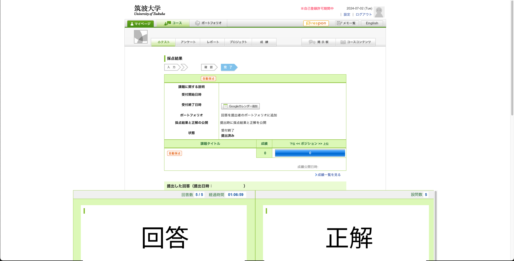

# manaba-answer-viewer

小テストの回答と正解を横並びで表示するユーザスクリプト  
Issue、PR 歓迎です



## Prerequisites

- Node.js 20
- pnpm 9

## Setup

```bash
$ git clone https://github.com/Gai-H/manaba-answer-viewer.git
$ cd manaba-answer-viewer
$ pnpm install
$ pnpm dev

$ pnpm build
```

## LICENSE

MIT

改変したい場合や他のプロジェクトに追加したい場合はライセンスの範囲でご自由にどうぞ
